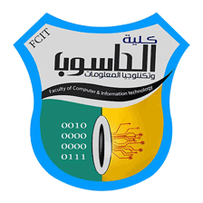
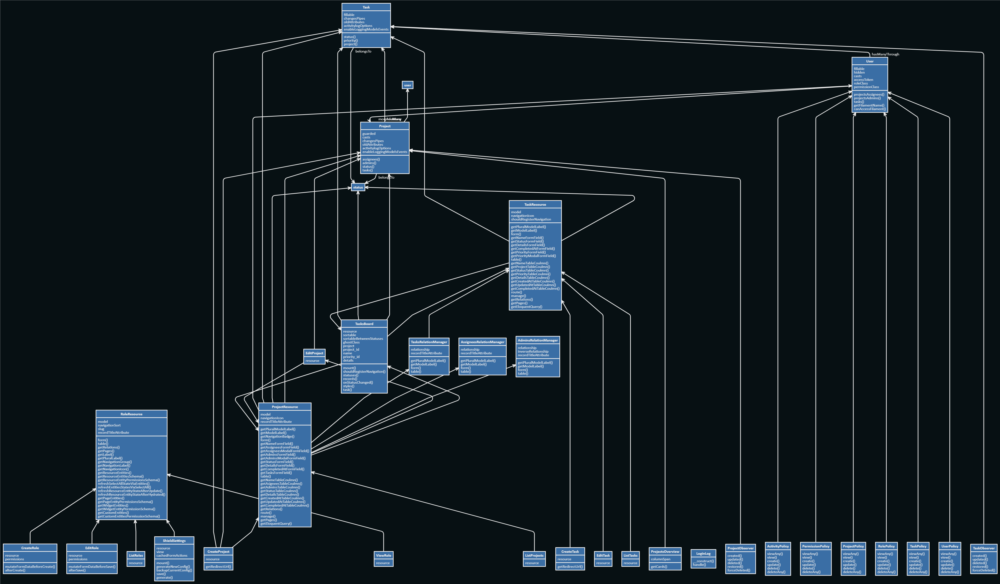
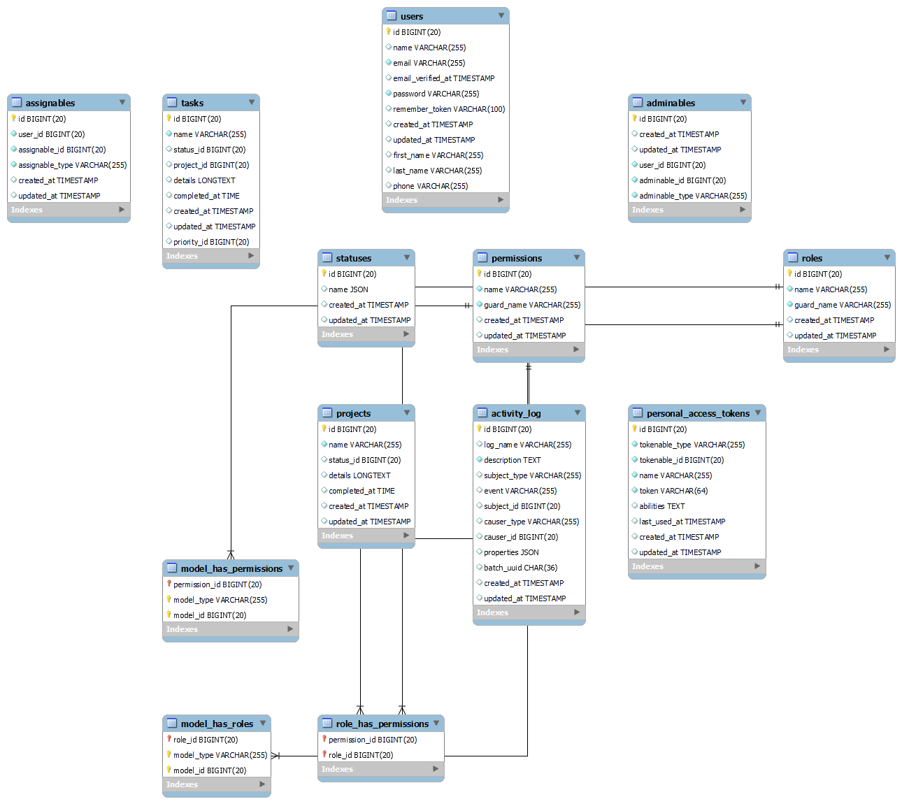
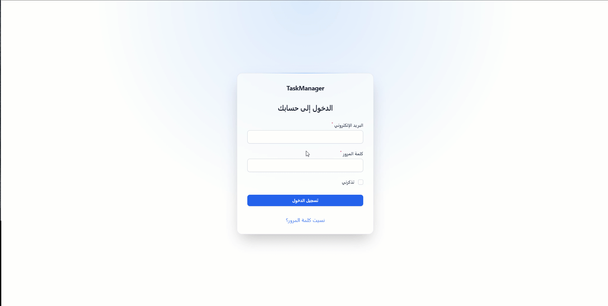

<div align="center"></div>
<div align="center">
<h2 align="center"><b>Built Using Tall Stack</b></h3>


Tailwind CSS           |  Alpine.js       |              Livewire       |     Laravel
:-------------------------:|:-------------------------:|:------------------:|-----------:
||  |  

</div>


<p align="center">
    <a href="https://tailwindcss.com/"></a>
    <a href="https://alpinejs.dev/"></a>
     <a href="https://laravel.com"></a>
    <a href="https://laravel-livewire.com"></a>
    <a href="https://php.net"></a>
</p>


---

<p align="center"> Few lines describing your project.
    <br> 
</p>

## 📝 Table of Contents

- [📝 Table of Contents](#-table-of-contents)
- [🧐 About <a name = "about"></a>](#-about-)
- [🔐 Peremissions <a name = "Peremissions"></a>](#-peremissions-)
- [⚙️ Features <a name = "Features"></a>](#️-features-)
- [🖼️ UML diagrams <a name = "UML"></a>](#️-uml-diagrams-)
- [📒 Database schema <a name = "Database"></a>](#-database-schema-)
- [🏁 Getting Started <a name = "getting_started"></a>](#-getting-started-)
  - [Requirments](#requirments)
  - [Installing](#installing)
- [🎈 Usage <a name="usage"></a>](#-usage-)
- [⛏️ Built Using <a name = "built_using"></a>](#️-built-using-)
- [✍️ Authors <a name = "authors"></a>](#️-authors-)

## 🧐 About <a name = "about"></a>

  This is app was built as a project at Sana'a University Colleage of Computer and Information Technology. it is a simple  Task managment app.  

 
## 🔐 Peremissions <a name = "Peremissions"></a>


Roles and Permissions are essentially three: 

1. Super Admin: 
            Can manage roles peremissions , backups , activity logs , add users , projects and tasks. 
2. Admin: 
          Can create projects, tasks , and edit them. 
3. user: 
          Can Edit tasks status to any status except of Done, for a task status to be changed to done an admin must change it. 
4. admins , and users can only see records they are involved in ie , they are assigned for that project or that project tasks. 

***

<br>

## ⚙️ Features <a name = "Features"></a>

<br>

***
- Change language  easily
***
<br>
<div align="center"> </div>
<br>

***
- Responsive Drag and Drop Task Board 
***
<br>
<br>

<br>
<div align="center"> </div>
<br>

***
- Sortable , Searchable Tables
***
<br>

<div align="center"> </div>
<br>

***
- Table Filtres
***
<br>

<div align="center"> </div>
<br>

***
- Exportable Tables to EXCEL
***
<br>

<div align="center"> </div>
<br>

***
- Activities within the system are auditable 
***
<br>

<div align="center"> </div>
<br>

## 🖼️ UML diagrams <a name = "UML"></a>
***
<br>
<div align="center"> </div>
<br>

***

## 📒 Database schema <a name = "Database"></a>
***
<br>
<div align="center"> </div>

<br>

***
## 🏁 Getting Started <a name = "getting_started"></a>

These instructions will get you a copy of the project up and running on your local machine for development and testing purposes. 

Alternativly you can start immediatly by reading the fast useage guide [useage <a name="usage"></a>](#-usage-)  then going to the demo site  

<a name='site demo'> https://taskmanager.stem-ye.com/admin </a>

use crediantials from the useage guide [useage <a name="usage"></a>](#-usage-).
### Requirments 

- Composer 
- Php ^8.0 
- Laravel 9.1 
- Livewire ^2.0
- Filamentphp ^2.0
- Mysql

### Installing

A step by step series of examples that tell you how to get a development env running.

> Copy .env.example file to .env and edit database credentials there

***

> Run 

```
composer install
```
> then Run 

```
php artisan key:generate
```
> then Run 

```
php artisan migrate:fresh --seed
```
> Finally run 

```
php artisan serve
```

Start using.


## 🎈 Usage <a name="usage"></a>

1. Log in as super admin
```
user: sadmin@sadmin.com

```   
```
password: password

```

***

<div align="center"> </div>

***

<br>

2. add users with user role to assign tasks to and  users with admin role to create projects, tasks and manage them.  
***

  
<div align="center"> </div>

***

<br>

3. Log as admin
```
user: admin@admin.com

```   
```
password: password

```

4. start adding projects, tasks , and assign users.

***

<div align="center"> </div>

***

<br>

5. Log in as user
   
         ```
         user: user@user.com

         ```   
         ```
         password: password

         ```
6. start intracting with tasks.
   
***

<div align="center"> </div>

***

note how task board persists statsues even after refreshing the page
<br>

***
<br>

## ⛏️ Built Using <a name = "built_using"></a>

- [Tailwind CSS](https://tailwindcss.com/) - Tailwind CSS
- [AlpineJS](https://alpinejs.dev/) - JavaScript  Framework
- [Laravel](https://Laravel.com/) - php Framework
- [LiveWire](https://laravel-livewire.com/) - Full stack Framework
- [Filament](https://filamentphp.com/) - Admin Dashboard 
- [MySql](https://www.mysql.com/) - Database
- [php](https://www.php.net/) - Php

## ✍️ Authors <a name = "authors"></a>

- [@zayedadel](https://github.com/zayedadel) Zayed Adel Almekhlafi 18_3253  
- Murad Abdullah ali alnajjar 18_3169
- Mohammed Abdusllam alshamery 18_3172
- Ahmed shukri hezam alhakimi19-16-3079